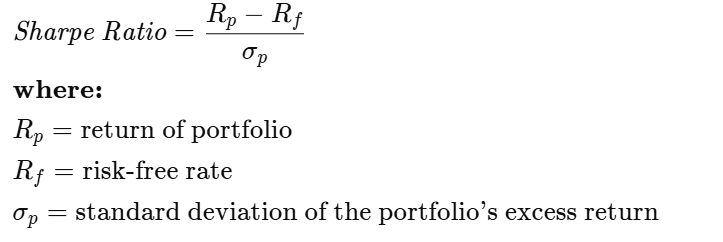
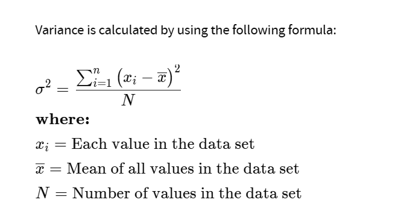

ER of portfolio = (ER of T-bill × Weight of T-bill) + (ER of Stock × Weight of Stock)

Risk of portfolio = Weight of Stock × Standard Deviation of Stock

The slope of the CAL measures the tradeoff between risk and return. A steeper slope means you would receive a higher expected return for taking on more risk.

Variance is a statistical measurement of how large of a spread there is within a data set. It measures how far each number in the set is from the mean (average), and thus from every other number in the set. Variance is often depicted by this symbol: σ2. The square root of the variance is the standard deviation (SD or σ), which helps determine the consistency of an investment’s returns over time.

"""
terminologies:
mkt_rf: return minus the risk free rate
term spread: difference between 10 year and 3 month treasury rates. If narrowing or inverted then 
recession
VIX: As a rule of thumb, VIX values greater than 30 are generally linked to significant 
volatility resulting from increased uncertainty, risk, and investors’ fear. 
VIX values below 20 generally correspond to stable, stress-free periods in the markets.

"""